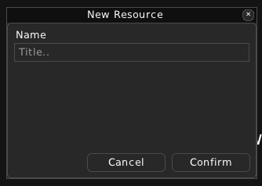
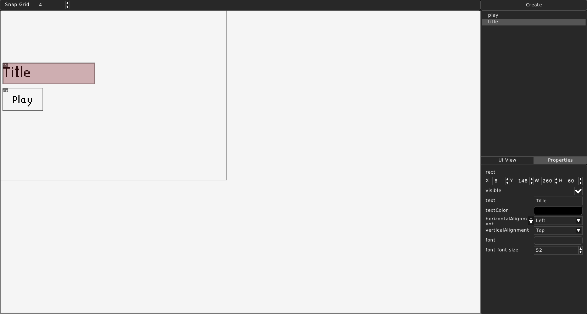
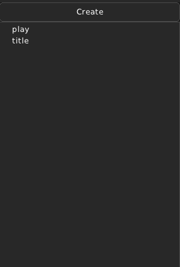
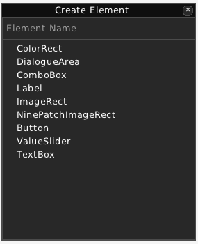
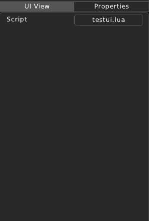
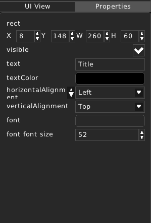
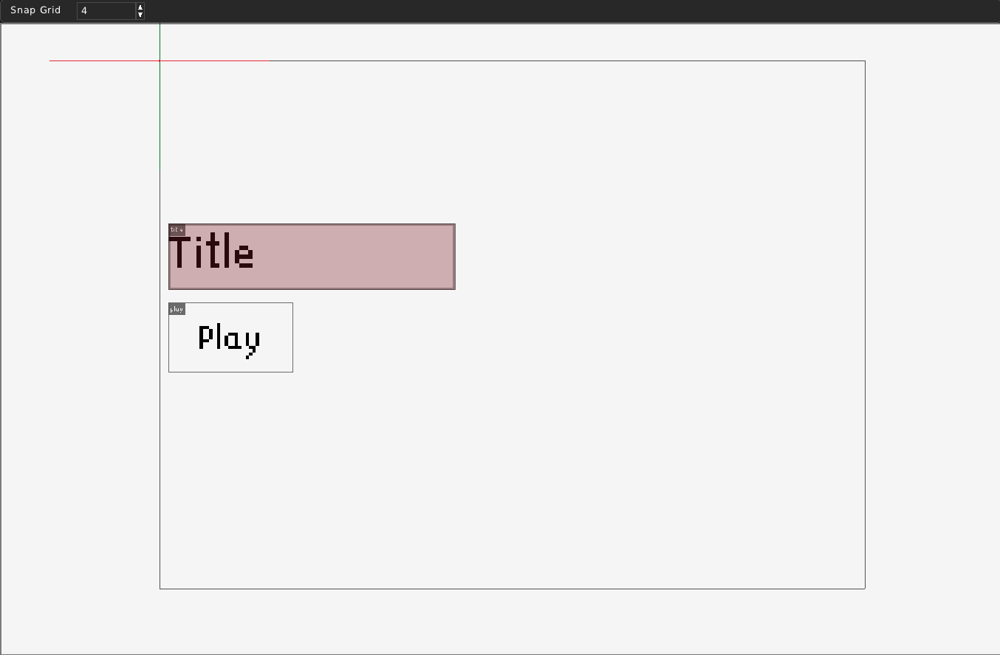
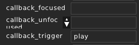

Interface View
==============

==========================
What is an Interface View?
==========================

An Interface View represents a group of UI elements/controls that will appear on the screen in-game. It can contain text labels, buttons and etc.

Interface View files have the ``.rview`` file extension.

======================================
Creating and editing an Interface View
======================================

You can create an UI View by providing a name for it.

After creation, you can see a preview of the Interface View itself, grid snap setting at the top, elements list and Create element button on the top right and Properties list on the bottom right.

=============
Elements List
=============

In the top right corner, you can see a 'Create' button and a list of UI Elements.

* **Create**

When you click 'Create', a 'Create Element' form will pop up. First enter the name of the element, then choose its type. RPG++ provides a set of UI Element types.

* **Element list**

You can see a list of UI Elements in this Interface View. Left-clicking on any of them will highlight them in the UI preview and will show its properties in the Properties List.
Right-clicking will reveal a context menu for this UI element.

	.. image:: ../../images/rpgpp-view-contextmenu.png
		:width: 40%

	* **Rename**: Rename this element. A Rename Element form will pop up, asking you to set a new name.

	* **Move Up**: Move this element one level up. Switches places with the element above it.

	* **Move Down**: Move this element one level down. Switches places with the element under it.

	* **Move to Top**: Move this element to the very top.

	* **Move to Bottom**: Move this element to the bottom of the hierarchy.

	* **Delete**: Delete this UI element.

===============
Properties List
===============

When viewing an Interface View file, the Properties List has two tabs: 'UI View' and 'Properties'

* **UI View**:

In this tab, you can see the properties of the Interface View itself. You can attach a script to it. See `Scripting`_

* **Properties**:

In this tab, you can see the properties of the currently selected UI Element.

===============
UI View Preview
===============

In the preview you can see the Interface View the same way it will appear in-game.

The gray borders outline the size of the game window.
Selected UI Element will be shown in red. You can move it around using the left mouse button. Holding it down will move it according to the snap setting.
You can also drag the sides of the element to resize it.

=========
Scripting
=========

You can attach scripts to Interface Views. This section will explain which parts are scriptable. Please refer to the Lua API Documentation for more information.

Your script can include a ``open()`` and/or a ``close()`` function.

.. code:: lua

	function open()
		print("The View was opened!")
	end

	function close()
		print("The View was closed!")
	end

It is also possible to access the UI Elements themselves and change them!

.. code:: lua

	function open()
		element = view:GetEntity("title")
		element.text = "My game!"
		print("The View was opened!")
	end

You can also listen to callbacks from UI Elements who have such properties, such as Buttons.
This example code will print a message when the button has been triggered. Its 'callback_triggered' property is set to the name of the function that will be called.

.. code:: lua

	function play()
		print("Play button pressed!")
	end
